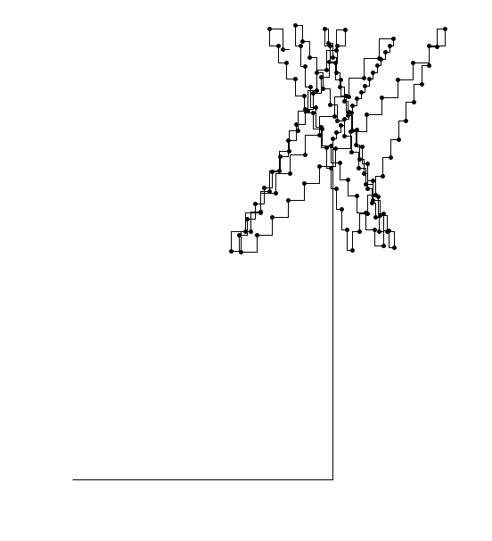

# Raspberry Pi Laser toy

## Hardware and configuration:

I followed the following guide, that is very detailed and easy to follow.
https://storiknow.com/automatic-cat-laser-pointer-toy-using-raspberry-pi-part-two/

## Code:

I wanted to check in some changes I made to the code on the site. I don't have a cat, but the family dog loves chasing the laser

## Test/Simulation

Created a unit test that uses turtle to show the movement that the laser would make. This helps visualize the paths and distribution over time.

